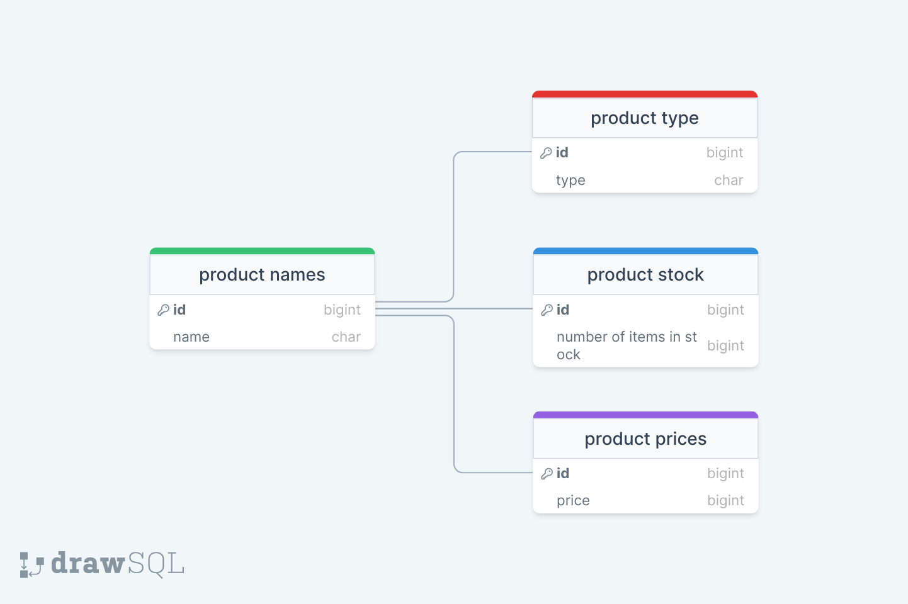

# Fullstack-Assessment

## Building project (haven't tested this myself. sorry):
- `git clone https://github.com/AhmadRehan98/gameball-assessment`
- `cd gameball-assessment`, type `npm install`.
- `cd ../frontend`, type `npm install`.

## Running the project:
- In rootdir `gameball-assessment`, type `npm run dev` or `npm run server && npm run client`

## TODO:
- Complete frontend pagination implementation.
- Implement sorting options.
- Fix some scaling in UI. remove some fixed length and widths.

## [Frontend](./frontend)
- Used Angular.
- Used Angular components to delegate design in a hierarchy. 
- Tried creating dynamic components from unrelated components (far..relatives?), but couldn't get it to work. Having a faraway TS function call another TS function to generate a dynamic component in its html component didn't work.
- So I maniuplated innerHTML with inline styling instead of using dynamic components to acheive some of the functionality needed: clicking food, electronics, fruits or vegetables show the corresponding items in the page.
- Had to use a listener to check if the user last clicked food or electronics to show the filter & sort tab.
- If I were to do this project from scratch. I'd use many more frontend pages/routing and show content in their own pages instead of dynamically loading everything in the same page. I can't foretell if this'll help much though, but I think the overall structure would be cleaner.

## [Backend](./backend)
- Used node.js.
- Public API GET: `/api/products/<product-name>`, where product name is: food, fruits, vegetables, electronics. This is the only routes the frontend currently uses.
- Skeleton functionality for POST, PUT, and DELETE, not fully implemented since it isn't required in the handout.

## Database
- I used MongoDB for my convenience.
- Since I used a non-sql DB, I added all data fields in one collection, since there shouldn't be a benefit in normalizing the data(?). 
- I've also dropped the data related to number of items and just assumed all items are available in unlimited quantity.
- But if were to use a SQL DB, this would be my schema:

  
